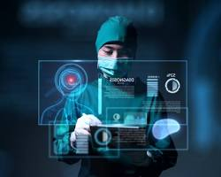
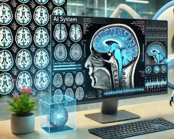
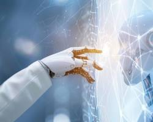

# Inteligência Artificial na Medicina
**Como as IAs Revolucionam Diagnósticos, Tratamentos e a Cura de Doenças**

## Introdução
A Inteligência Artificial (IA) está transformando a medicina, impactando diagnósticos, tratamentos e prevenção de doenças. Este ebook explora como a IA está sendo aplicada na medicina moderna e seus benefícios para pacientes e profissionais de saúde.

---

## Capítulo 1 – O Papel da IA nos Diagnósticos Médicos
A IA tem revolucionado a forma como doenças são detectadas. Algoritmos avançados analisam imagens médicas como radiografias, tomografias e ressonâncias, muitas vezes com precisão superior à de médicos experientes.

**Exemplos práticos:**
- Diagnóstico precoce de câncer de mama com redes neurais.
- Identificação de doenças oculares a partir de imagens da retina.
- Sistemas de triagem que priorizam pacientes em emergências.

**Estatísticas:**
- Mercado global de IA em diagnósticos médicos em 2023: US$ 1,33 bi; previsão para 2030: US$ 4,72 bi ([Market & Markets](https://www.marketsandmarkets.com/Market-Reports/artificial-intelligence-medical-diagnostics-market-22519734.html)).
- 70% dos profissionais de saúde acreditam que a IA melhora a qualidade do atendimento.

---

## Capítulo 2 – IA no Desenvolvimento de Tratamentos

**Exemplos práticos:**
- Desenvolvimento de medicamentos personalizados.
- Descoberta de novos fármacos por simulação química.
- Ajuste de doses em tempo real para pacientes críticos.

**Estatísticas:**
- Mais de 150 medicamentos impulsionados por IA em testes clínicos globalmente.
- Redução de custos na descoberta de medicamentos em 30–50%.

---

## Capítulo 3 – IA na Prevenção de Doenças

**Exemplos práticos:**
- Previsão de ataques cardíacos a partir de sinais vitais.
- Detecção precoce de diabetes e doenças metabólicas.
- Alertas para surtos de doenças infecciosas.

**Estatísticas:**
- 48% dos hospitais dos EUA usam IA para prever eventos adversos.
- A IA ajuda a reduzir lacunas de acesso à saúde.

---

## Capítulo 4 – O Futuro da Medicina com IA

**Tendências futuras:**
- Medicina de precisão baseada em genômica.
- Robôs cirúrgicos inteligentes.
- IA que aprende continuamente com novos casos clínicos.

**Estatísticas:**
- 23.306 artigos publicados em 2023 sobre IA na saúde.
- 85% dos líderes de saúde já exploram IA generativa ([McKinsey](https://www.mckinsey.com/industries/healthcare/our-insights/generative-ai-in-healthcare-current-trends-and-future-outlook)).

---

## Conclusão
A IA redefine a medicina, trazendo diagnósticos mais precisos, tratamentos personalizados e prevenção mais eficaz. Profissionais de saúde e pacientes se beneficiam diretamente da adoção dessas tecnologias.

---

## Bônus – Como Profissionais de Saúde Podem se Beneficiar
- Treinamentos em IA aplicada à saúde.
- Integração de softwares inteligentes em hospitais e consultórios.
- Acompanhamento de pesquisas e novas tecnologias médicas.

---

## Referências
1. [Market & Markets](https://www.marketsandmarkets.com/Market-Reports/artificial-intelligence-medical-diagnostics-market-22519734.html)
2. [Keragon – IA na Saúde](https://www.keragon.com/blog/ai-in-healthcare-statistics)
3. [World Economic Forum](https://www.weforum.org/stories/2025/08/ai-transforming-global-health)
4. [McKinsey – IA Generativa na Saúde](https://www.mckinsey.com/industries/healthcare/our-insights/generative-ai-in-healthcare-current-trends-and-future-outlook)
